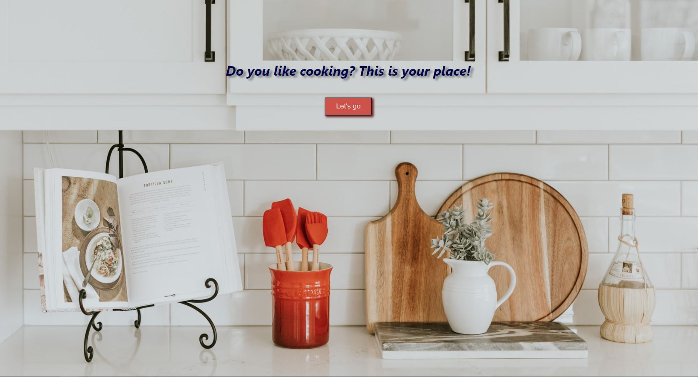
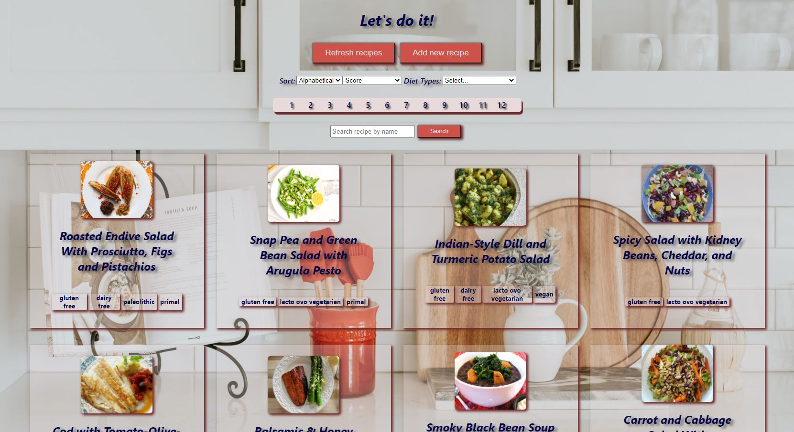
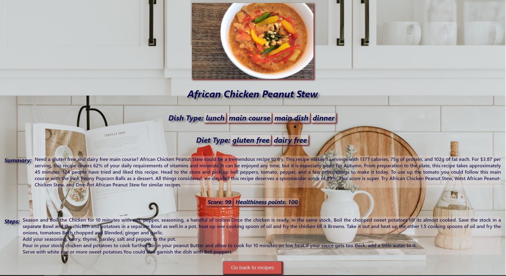
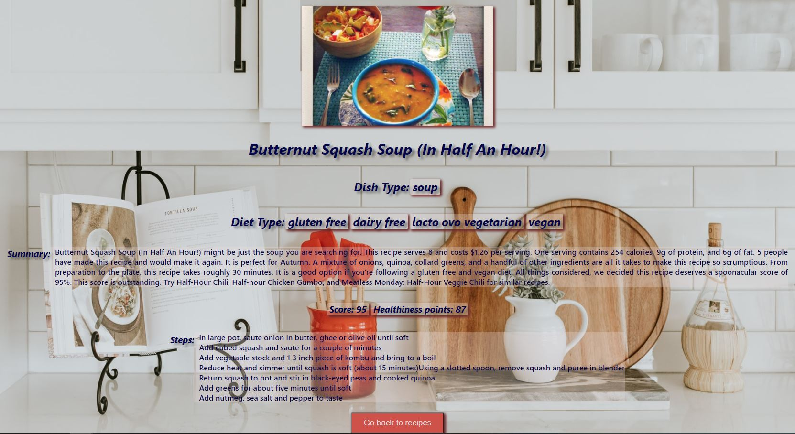
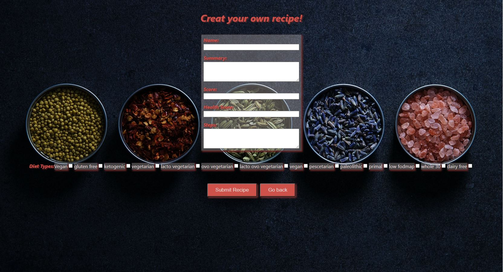

  

### Hi everyone 👋

### My name is Pablo, but everybody calls me Lole! 
Finding my way in this wonderful world of programming.
And as you can see, I'm a dog lover 🐕

<h2> Languages and Tools </h2>
JavaScript - HTML - CSS - React - Redux  
NodeJS - Express - PostgreSQL - Sequelize  
Git - Babel - Webpack - TypeScript

  <h2> Projects </h2>

  

    <h3>My Recipes Web App</h3>
    🚀 Technologies used: 
    React - Redux - NodeJS - Express - PostgreSQL - Sequelize
    

      
      
      
      
      
      
    

  

  

    <h3>RocketPlay</h3>
    

      
    

    Work in progress... An app we are working on with my Henry's teammates as a final project.
  

<h2> Contact me </h2>

   
   
   
    

   

<!--
**LOLE81/LOLE81** is a ✨ _special_ ✨ repository because its `README.md` (this file) appears on your GitHub profile.

Here are some ideas to get you started:

- 🔭 I’m currently working on ...
- 🌱 I’m currently learning ...
- 👯 I’m looking to collaborate on ...
- 🤔 I’m looking for help with ...
- 💬 Ask me about ...
- 📫 How to reach me: ...
- 😄 Pronouns: ...
- ⚡ Fun fact: ...
-->
